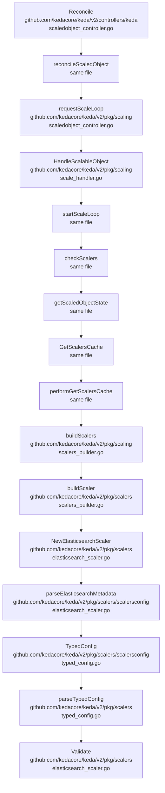

Based on v2.17.1

## bootup process
### operator
### metrics-apiserver
### webhooks

## reconcile process

- reconcileScaledObject
- startPushScaler
- startScaleLoop 
	checkScalers

	
isActive, isError, metricsRecords, activeTriggers, err := h.getScaledObjectState
- GetScalersCache
  - using exist scaler
  - create new scaler
- Build scaler
  - NewXXXScaler
    - parse(validate) XXX metadata
- getScalerState
  - GetMetricSpecForScaling
  - GetMetricsAndActivity
h.scaleExecutor.RequestScale(ctx, obj, isActive, isError, &executor.ScaleExecutorOptions{ActiveTriggers: activeTriggers})
  - scaling up
    pkg/scaling/executor/scale_scaledobjects.go
113:                    e.scaleFromZeroOrIdle(ctx, logger, scaledObject, currentScale, options.ActiveTriggers)
  - scaling down
    pkg/scaling/executor/scale_scaledobjects.go
169:                    e.scaleToZeroOrIdle(ctx, logger, scaledObject, currentScale)

## 2 Layers validation
CRD
- tag validation
- admission webhook
Trigger
- runtime validation

#### validation example

