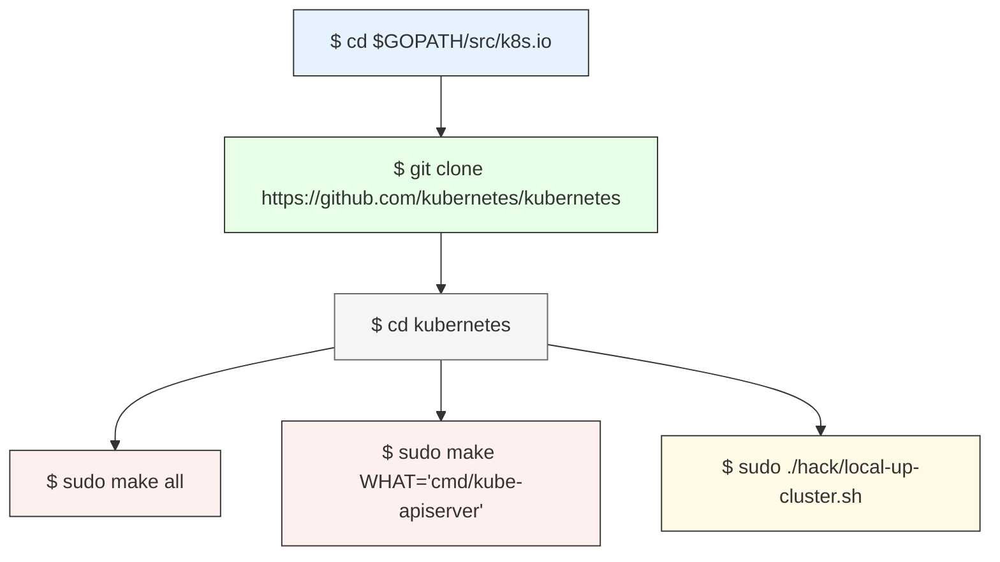

以下是基于《Kubernetes API Server源码分析与扩展开发》的章节解析及相关官方文档链接，结合Kubernetes核心架构与扩展开发实践：

---

### **第一篇：基础篇**
#### **第3章 API Server**  
**核心内容**：  
- API Server的架构设计，包括RESTful API层、认证/授权/准入控制（AAA）机制、Watch机制与Etcd交互逻辑。  
- 关键功能：集群唯一入口、资源持久化存储、高可用性部署（3副本模式）。  
**官方文档**：  
- [Kubernetes API Server Overview](https://kubernetes.io/docs/concepts/overview/components/#kube-apiserver)  
- [API Server Security](https://kubernetes.io/docs/reference/access-authn-authz/controlling-access/)  

---

#### **第4章 Kubernetes API**  
**核心内容**：  
- API分组（Core/Apps/Networking等）、版本控制策略（v1beta1→v1）及GVK（Group/Version/Kind）模型。  
- OpenAPI规范与资源路径设计（如`/api/v1/pods`与`/apis/apps/v1/deployments`）。  
**官方文档**：  
- [Kubernetes API Concepts](https://kubernetes.io/docs/reference/using-api/api-concepts/)  
- [API Versioning](https://kubernetes.io/docs/reference/using-api/#api-versioning)  

---

### **第二篇：源码篇**
#### **第5章 Generic Server**  
**核心内容**：  
- Kubernetes通用服务框架（`GenericAPIServer`）的实现，包括安全层（SecureServingInfo）、中间件（认证/授权）与插件化架构。  
- 模块解耦设计：通过Go接口支持多子Server扩展。  
**官方文档**：  
- [Kubernetes API Extensions](https://kubernetes.io/docs/concepts/extend-kubernetes/)  

---

#### **第6章 主Server**  
**核心内容**：  
- `kube-apiserver`主服务的启动流程（`CreateServerChain`函数），依赖组件（Etcd、审计日志）的集成。  
- 关键参数解析（`--etcd-servers`、`--authorization-mode`）。  
**官方文档**：  
- [kube-apiserver Configuration](https://kubernetes.io/docs/reference/command-line-tools-reference/kube-apiserver/)  

---

#### **第7章 扩展Server**  
**核心内容**：  
- 扩展模式对比：CRD vs. Aggregated API，典型场景如Metrics Server实现。  
- 安全隔离：Service Account权限管理与RBAC集成。  
**官方文档**：  
- [Custom Resource Definitions (CRD)](https://kubernetes.io/docs/concepts/extend-kubernetes/api-extension/custom-resources/)  
- [Aggregated API](https://kubernetes.io/docs/concepts/extend-kubernetes/api-extension/apiserver-aggregation/)  

---

#### **第8章 聚合器和聚合Server**  
**核心内容**：  
- 聚合层（`kube-aggregator`）的动态路由机制，APIService资源的注册与发现。  
- 案例：Service Catalog通过聚合API接入Kubernetes。  
**官方文档**：  
- [APIService Resource](https://kubernetes.io/docs/reference/kubernetes-api/cluster-resources/api-service-v1/)  

---

### **第三篇：实战篇**
#### **第9章 开发聚合Server**  
**核心内容**：  
- 手动实现聚合API Server：`APIGroupInfo`注册、StorageProvider对接Etcd、本地测试验证。  
- 不使用脚手架，直接基于`client-go`和`apimachinery`开发。  
**官方文档**：  
- [Building an Aggregated API Server](https://kubernetes.io/docs/tasks/extend-kubernetes/setup-extension-api-server/)  

---

#### **第10章 API Server Builder与Kubebuilder**  
**核心内容**：  
- 工具对比：API Server Builder（Aggregated API开发） vs. Kubebuilder（Operator开发）。  
- 代码生成能力：DeepCopy函数、Clientset生成逻辑[citation:10]。  
**官方文档**：  
- [Kubebuilder Documentation](https://book.kubebuilder.io/)  

---

#### **第11章 API Server Builder开发聚合Server**  
**核心内容**：  
- 基于脚手架重构第9章实现，生成Swagger文档、集成Prometheus监控。  
- 性能优化：缓存策略与并发控制。  
**官方文档**：  
- [API Server Builder Guide](https://github.com/kubernetes-sigs/apiserver-builder-alpha)  

---

#### **第12章 Kubebuilder开发Operator**  
**核心内容**：  
- Operator开发实践：Reconciler模式、Webhook Conversion多版本兼容[citation:10]。  
- 生态整合：与Prometheus-Operator、Cert-Manager的协作[citation:10]。  
**官方文档**：  
- [Operator SDK](https://sdk.operatorframework.io/)  
- [Kubebuilder Quick Start](https://book.kubebuilder.io/quick-start.html)  

---

### **总结与扩展资源**
- **官方文档入口**：  
  - [Kubernetes API Reference](https://kubernetes.io/docs/reference/kubernetes-api/)  
  - [Kubernetes Security Best Practices](https://kubernetes.io/docs/concepts/security/)  
- **进阶阅读**：  
  - [Kubernetes源码分析书籍](http://tup.tsinghua.edu.cn/bookscenter/book_10600601.html)  
  - [Kubernetes API Server健康检查](https://kubernetes.io/docs/reference/using-api/health-checks/)  

