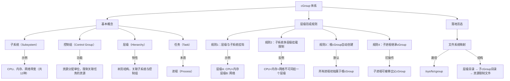
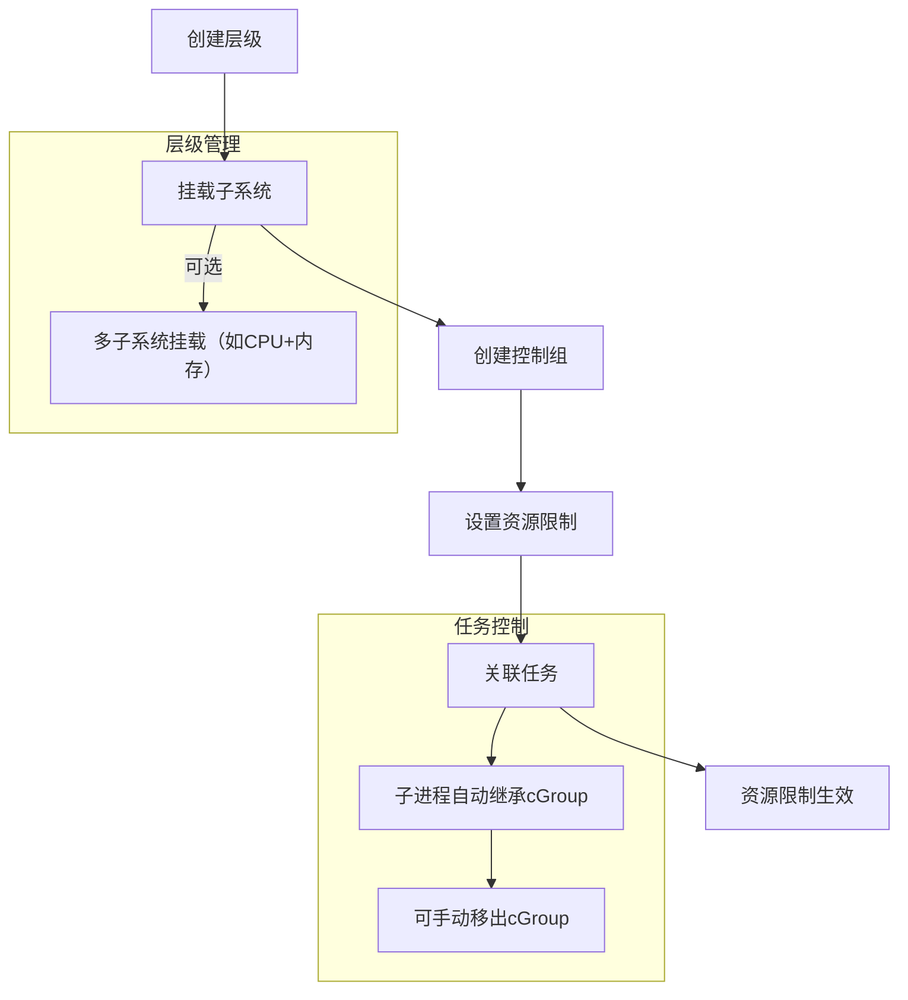

方海涛 sealos作者，五年以上容器平台与系统研发经验
kube-dev-book
https://github.com/fanux/kube-dev-book/tree/master

《kubernetes 权威指南》第4版书中示例源码
纯手打，顺便用注释做简单的笔记
基于Kubernetes v1.18环境测试
https://github.com/callmer00t/kubeguide_example

海龙张， 立吧
Kubernetes文章列表
https://mp.weixin.qq.com/s/TVYL3tILuVydtODpzUAgDQ
以下是基于文章内容的 **Mermaid 格式概念关系图** 和 **核心逻辑解析**：

### **Mermaid 图表：cGroup 核心概念与关系**

### **关键概念解析**
1. **子系统（Subsystem）**  
   - **本质**：资源类型（如CPU、内存）。  
   - **作用**：定义cGroup管理的资源类别，共12种。

2. **控制组（Control Group）**  
   - **功能**：资源分配的最小单位，通过限制值约束任务资源使用。  
   - **关系**：隶属于某个层级，形成树形结构。

3. **层级（Hierarchy）**  
   - **核心规则**：  
     - 一个层级可挂载多个子系统（如CPU+内存）。  
     - 同一子系统不可跨层级挂载（除非层级仅含该子系统）。  
   - **树形结构**：根cGroup默认包含所有进程，子cGroup继承父资源限制。

4. **任务（Task）**  
   - **本质**：进程，通过关联到cGroup受资源限制。

5. **落地形态**  
   - **文件系统映射**：通过`/sys/fs/cgroup`目录管理，层级和cGroup表现为目录，资源限制值为文件。

### **逻辑流程图：cGroup 资源分配流程**

### **总结**
1. **核心思想**：通过层级树和子系统挂钩，将进程分组并分配资源配额。  
2. **关键规则**：  
   - 子系统的挂载需符合层级唯一性约束。  
   - 进程的cGroup关系可继承和修改。  
3. **实际应用**：Docker等容器技术利用cGroup实现资源隔离（如`docker run --memory=1g`）。  

若需补充具体操作命令或扩展子系统类型，可进一步调整图表内容。