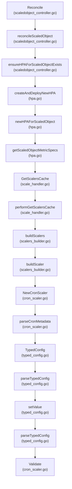
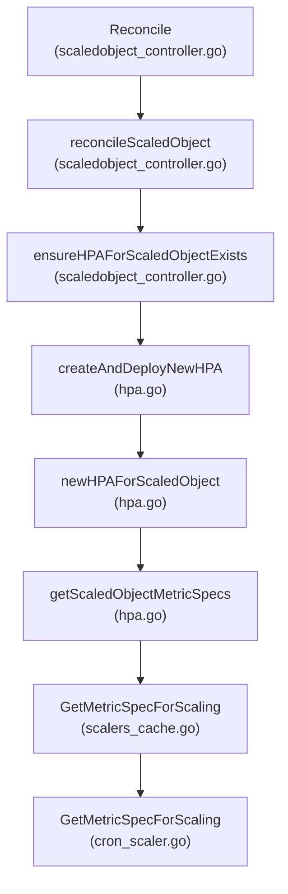
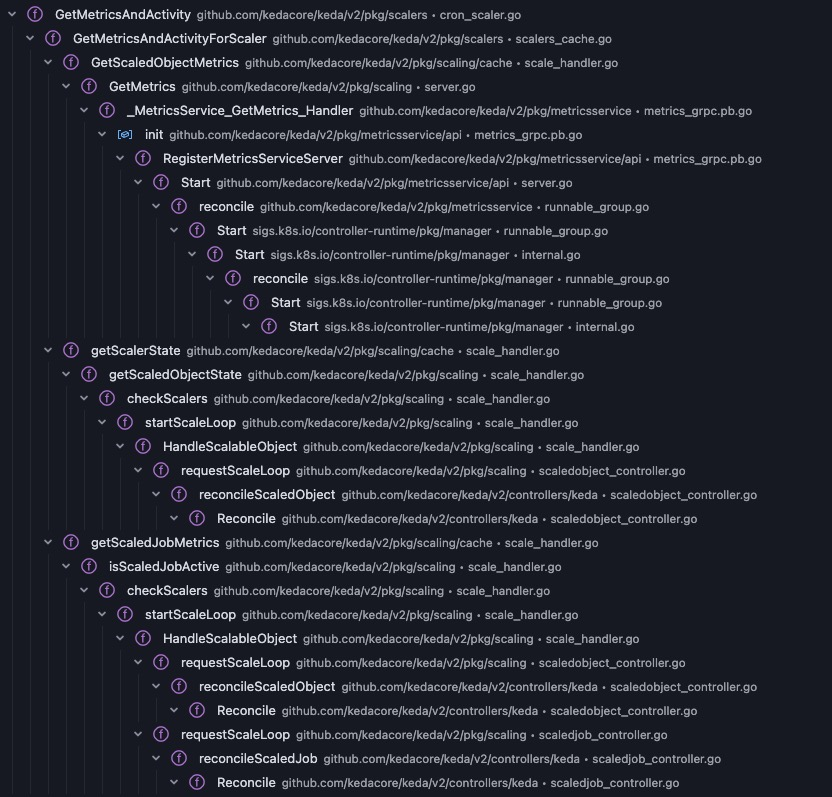
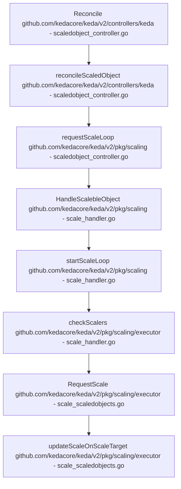
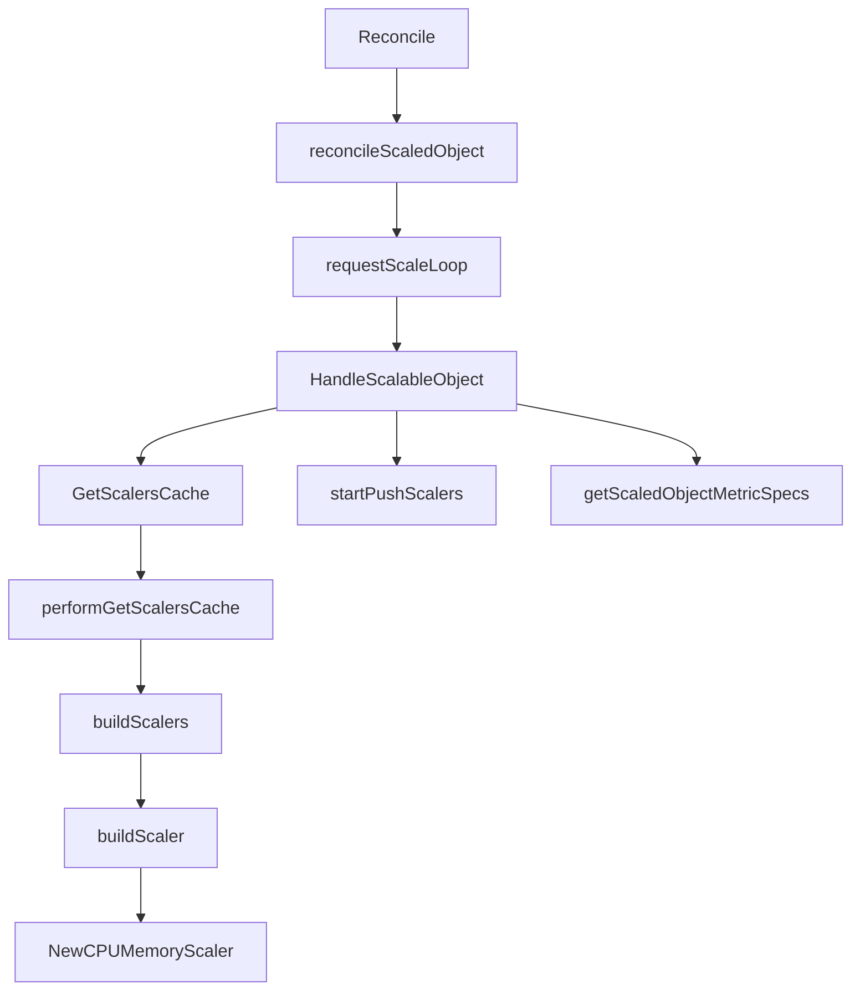
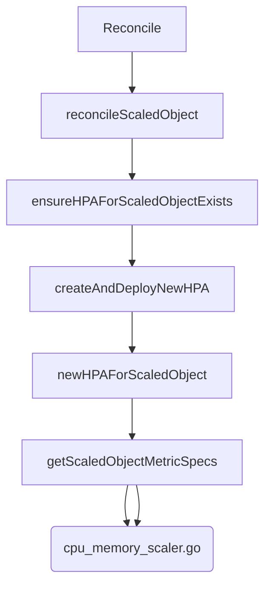
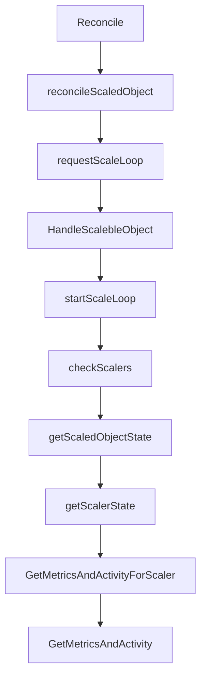

### Scaler

#### Validation

#### GetMetricsSpecForScaling

#### GetMetricsAndActivity


#### RequestScale

```go
func (h *scaleHandler) checkScalers(ctx context.Context, scalableObject interface{}, scalingMutex sync.Locker) {
		...
		isActive, isError, metricsRecords, activeTriggers, err := h.getScaledObjectState(ctx, obj)
		if err != nil {
			log.Error(err, "error getting state of scaledObject", "scaledObject.Namespace", obj.Namespace, "scaledObject.Name", obj.Name)
			return
		}

		h.scaleExecutor.RequestScale(ctx, obj, isActive, isError, &executor.ScaleExecutorOptions{ActiveTriggers: activeTriggers})
```

### External Scaler
graph TD
    A[Reconcile github.com/kedacore/keda/v2/controllers/keda - scaledobject_controller.go] --> B[reconcileScaledObject github.com/kedacore/keda/v2/controllers/keda - scaledobject_controller.go]
    B --> C[requestScaleLoop github.com/kedacore/keda/v2/pkg/scaling - scaledobject_controller.go]
    C --> D[HandleScalableObject github.com/kedacore/keda/v2/pkg/scaling - scale_handler.go]
    D --> E[startScaleLoop github.com/kedacore/keda/v2/pkg/scaling - scale_handler.go]
    E --> F[checkScalers github.com/kedacore/keda/v2/pkg/scaling - scale_handler.go]
    F --> G[getScaledObjectState github.com/kedacore/keda/v2/pkg/scaling - scale_handler.go]
    G --> H[getScalerState github.com/kedacore/keda/v2/pkg/scaling/cache - scale_handler.go]
    H --> I[GetScaledObjectMetrics github.com/kedacore/keda/v2/pkg/scaling/cache - scale_handler.go]
    I --> J[GetMetricsAndActivityForScaler github.com/kedacore/keda/v2/pkg/scalers - scalers_cache.go]
    J --> K[GetMetricsAndActivity github.com/kedacore/keda/v2/pkg/scalers - external_scaler.go]
    K --> L[getClientForConnectionPool github.com/kedacore/keda/v2/pkg/scalers - external_scaler.go]

#### [GetMetricsAndActivity](https://github.com/kedacore/keda/blob/9b954d4430e2530cc4bb700528e148b6baac2de7/pkg/scalers/external_scaler.go#L209)

##### grpcClient.GetMetrics
##### grpcClient.IsActive

### admission webhook:
#### keda
#####  define the validator
```go
apis/keda/v1alpha1/scaledobject_webhook.go
type ScaledObjectCustomValidator struct{}

func (socv ScaledObjectCustomValidator) ValidateCreate(ctx context.Context, obj runtime.Object) (warnings admission.Warnings, err error) {
	request, err := admission.RequestFromContext(ctx)
	if err != nil {
		return nil, err
	}
	so := obj.(*ScaledObject)
	return so.ValidateCreate(request.DryRun)
}
```
```sh
.
└── github.com
    └── kedacore
        └── keda
            ├── v2
            │   └── apis
            │       └── keda
            │           └── v1alpha1
            │               └── scaledobject_webhook.go
            │                   ├── ValidateCreate
            │                   ├── validateWorkload
            │                   └── verifyCPUMemoryScalers
            └── v1alphal
                └── scaledobject_webhook.go
                    └── ValidateCreate

```
##### register the path
```go
// vendor/sigs.k8s.io/controller-runtime/pkg/builder/webhook.go
func generateValidatePath(gvk schema.GroupVersionKind) string {
	return "/validate-" + strings.ReplaceAll(gvk.Group, ".", "-") + "-" +
		gvk.Version + "-" + strings.ToLower(gvk.Kind)
}
```
##### register the handler
```go
// vendor/sigs.k8s.io/controller-runtime/pkg/builder/webhook.go
func (blder *WebhookBuilder) registerValidatingWebhook() {
	vwh := blder.getValidatingWebhook()
	if vwh != nil {
		vwh.LogConstructor = blder.logConstructor
		path := generateValidatePath(blder.gvk)
		// Checking if the path is already registered.
		// If so, just skip it.
		if !blder.isAlreadyHandled(path) {
			log.Info("Registering a validating webhook",
				"GVK", blder.gvk,
				"path", path)
			blder.mgr.GetWebhookServer().Register(path, vwh)
		}
	}
}
```
[call chain](https://deepseek-api-files.obs.cn-east-3.myhuaweicloud.com/raw/2025/05/01/file-b8070af1-5a0d-40eb-8d9e-552cdc4e3726?response-content-disposition=attachment%3B+filename%3D%22image.png%22&AccessKeyId=OD83TSXECLFQNNSZ3IF6&Expires=1746169040&Signature=APN0k66wMcolF8ei0hPhO7I%2FTWg%3D)

##### add validating webhook for apiserver
```yaml
// keda-admission-webhook.yaml
apiVersion: admissionregistration.k8s.io/v1
kind: ValidatingWebhookConfiguration

webhooks:
- admissionReviewVersions:
  - v1
  clientConfig:
    caBundle: xxxx
    service:
      name: keda-admission-webhooks
      namespace: keda
      path: /validate-keda-sh-v1alpha1-scaledobject
      port: 443
  failurePolicy: Ignore
  matchPolicy: Equivalent
  name: vscaledobject.kb.io
  namespaceSelector: {}
  objectSelector: {}
  rules:
  - apiGroups:
    - keda.sh
    apiVersions:
    - v1alpha1
    operations:
    - CREATE
    - UPDATE
    resources:
    - scaledobjects
    scope: '*'
```

### KEDA operator
##### log for process of reconcilation
```sh
➜  keda git:(master) ✗ k logs -n keda -f keda-operator-b5dcb8455-b66dc
```
```go
controllers/keda/scaledobject_controller.go
func (r *ScaledObjectReconciler) reconcileScaledObject(ctx context.Context, logger logr.Logger, scaledObject *kedav1alpha1.ScaledObject, conditions *kedav1alpha1.Conditions) (string, error) {
  ...
	newHPACreated, err := r.ensureHPAForScaledObjectExists(ctx, logger, scaledObject, &gvkr)
  ...


func (h *scaleHandler) HandleScalableObject(ctx context.Context, scalableObject interface{}) error {
```
##### digram for cpu and mem scaler

[NewCPUMemoryScaler](https://deepseek-api-files.obs.cn-east-3.myhuaweicloud.com/raw/2025/05/01/file-111d8b6a-4298-484b-b72d-6164e0bb250a?response-content-disposition=attachment%3B+filename%3D%22image.png%22&AccessKeyId=OD83TSXECLFQNNSZ3IF6&Expires=1746176547&Signature=3bL5ewPEZ9uRJJ2Er10S2Js%2FLME%3D)


##### digram for scaler GetMetricSpecForScaling


[GetMetricSpecForScaling](https://deepseek-api-files.obs.cn-east-3.myhuaweicloud.com/raw/2025/05/01/file-fd7b7d22-cb10-4571-b23d-b4c558bb2698?response-content-disposition=attachment%3B+filename%3D%22image.png%22&AccessKeyId=OD83TSXECLFQNNSZ3IF6&Expires=1746175996&Signature=imRxBdUZbYManlraZJ6ix8rpMX0%3D)

##### digram for scaler getMetricsAndActivity

[getMetricsAndActivity](https://deepseek-api-files.obs.cn-east-3.myhuaweicloud.com/raw/2025/05/01/file-501fbd63-40c9-4a76-a3f1-d637a7add5ae?response-content-disposition=attachment%3B+filename%3D%22image.png%22&AccessKeyId=OD83TSXECLFQNNSZ3IF6&Expires=1746191903&Signature=WjiNlw6IvbNxZynTj96u4ZHUs7Q%3D)

### HPA controller

- [horizontal](https://github.com/kubernetes/kubernetes/blob/master/pkg/controller/podautoscaler/horizontal.go#881)
- [replicaset](https://github.com/kubernetes/kubernetes/blob/master/pkg/controller/replicaset/replica_set.go#676)
- [metricsclient](https://github.com/kubernetes/kubernetes/blob/master/pkg/controller/podautoscaler/metrics/client.go#L110)
```sh
I0501 08:45:46.259469       1 horizontal.go:881] "Successfully rescaled" logger="horizontal-pod-autoscaler-controller" HPA="default/keda-hpa-cpu-scaledobject" currentReplicas=4 desiredReplicas=6 reason="cpu resource utilization (percentage of request) above target"
I0501 08:45:46.485991       1 replica_set.go:676] "Finished syncing" logger="replicaset-controller" kind="ReplicaSet" key="default/php-apache-678865dd57" duration="183.366ms"
...
I0501 08:45:46.557188       1 replica_set.go:676] "Finished syncing" logger="replicaset-controller" kind="ReplicaSet" key="default/php-apache-678865dd57" duration="211.4µs"
I0501 08:45:52.281219       1 replica_set.go:676] "
```

##### scaling

```sh
kubectl run -i --tty load-generator --rm --image=busybox:1.28 --restart=Never -- /bin/sh -c "while sleep 0.01; do wget -q -O- http://php-apache; done"
```

##### calculate metrics utilization
```sh
https://github.com/kubernetes/kubernetes/blob/master/pkg/controller/podautoscaler/horizontal.go#L871

https://github.com/kubernetes/kubernetes/blob/master/pkg/controller/podautoscaler/metrics/utilization.go#L26

https://github.com/kubernetes/kubernetes/blob/master/pkg/controller/podautoscaler/replica_calculator.go#L115
```

### References

api-aggregation:
- https://kubernetes.io/docs/tasks/extend-kubernetes/configure-aggregation-layer/
- https://kubernetes.io/docs/concepts/extend-kubernetes/api-extension/apiserver-aggregation/

metrics-server:
- https://github.com/kubernetes-sigs/metrics-server

HPA:
- https://kubernetes.io/docs/tasks/run-application/horizontal-pod-autoscale/
- https://kubernetes.io/docs/tasks/run-application/horizontal-pod-autoscale-walkthrough/
- https://kubernetes.io/docs/tasks/run-application/horizontal-pod-autoscale/#algorithm-details
- https://kubernetes.io/docs/concepts/configuration/manage-resources-containers/#requests-and-limits
