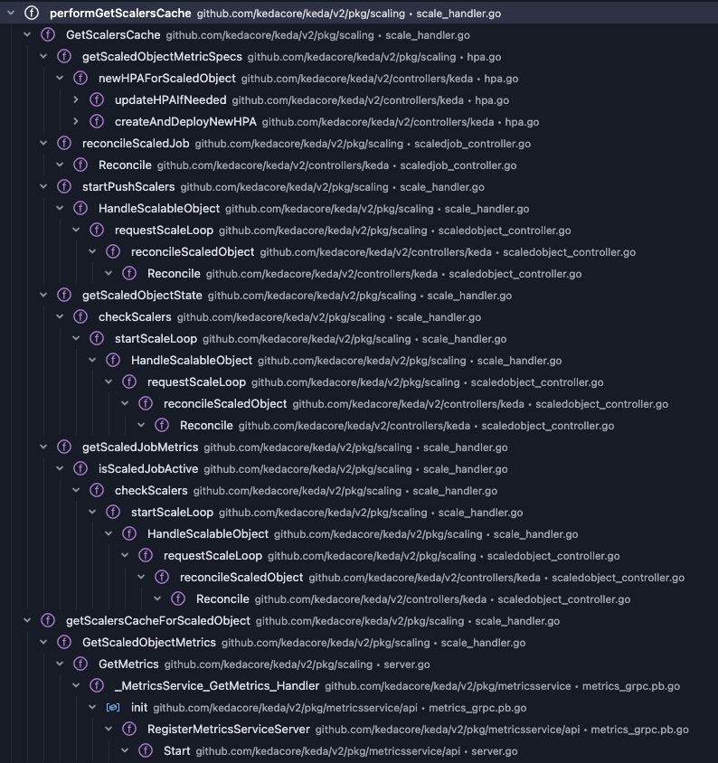

### Scaler

### reconcile scaledObject
#### performGetScalersCache
- cache scaler based on scaledObject

```go
// keda/pkg/scaling/scale_handler.go
func (h *scaleHandler) performGetScalersCache(ctx context.Context, key string, scalableObject interface{}, scalableObjectGeneration *int64, scalableObjectKind, scalableObjectNamespace, scalableObjectName string) (*cache.ScalersCache, error) {
    ...
    // check the cache if it exists
	if cache, ok := h.scalerCaches[key]; ok {
		if scalableObjectGeneration != nil {
			if cache.ScalableObjectGeneration == *scalableObjectGeneration {
				h.scalerCachesLock.RUnlock()
				return cache, nil
			}
		} else {
			h.scalerCachesLock.RUnlock()
			return cache, nil
		}
	}
    // create and cache the scaler if not exists
	scalers, err := h.buildScalers(ctx, withTriggers, podTemplateSpec, containerName, asMetricSource)
    newCache := &cache.ScalersCache{
		Scalers:                  scalers,
		ScalableObjectGeneration: withTriggers.Generation,
		Recorder:                 h.recorder,
	}
	switch obj := scalableObject.(type) {
	case *kedav1alpha1.ScaledObject:
d       ...
		newCache.ScaledObject = obj
	}
	h.scalerCaches[key] = newCache
	return newCache, nil
}
// keda/pkg/scaling/scale_handler.go
func (h *scaleHandler) buildScalers(ctx context.Context, withTriggers *kedav1alpha1.WithTriggers, podTemplateSpec *corev1.PodTemplateSpec, containerName string, asMetricSource bool) ([]cache.ScalerBuilder, error) {
    ...
	for i, t := range withTriggers.Spec.Triggers {
        ...
		scaler, config, err := factory()
        ...
        result = append(result, cache.ScalerBuilder{
			Scaler:       scaler,
			ScalerConfig: *config,
			Factory:      factory,
		})
	}
	return result, nil
}
```

#### Validation

#### GetMetricsSpecForScaling

#### GetMetricsAndActivity


#### startScaleLoop[startScaleLoop](https://github.com/kedacore/keda/blob/96f77ae477ff64d918f239720eae4f9edff091f5/pkg/scaling/scale_handler.go#L166)

##### checkScalers[checkScalers](https://github.com/kedacore/keda/blob/96f77ae477ff64d918f239720eae4f9edff091f5/pkg/scaling/scale_handler.go#L234)
```go
func (h *scaleHandler) checkScalers(ctx context.Context, scalableObject interface{}, scalingMutex sync.Locker) {
        ...
		isActive, isError, metricsRecords, activeTriggers, err := h.getScaledObjectState(ctx, obj)
        ...
		h.scaleExecutor.RequestScale(ctx, obj, isActive, isError, &executor.ScaleExecutorOptions{ActiveTriggers: activeTriggers})
```
###### getScaledObjectState
```go
func (h *scaleHandler) getScaledObjectState(ctx context.Context, scaledObject *kedav1alpha1.ScaledObject) (bool, bool, map[string]metricscache.MetricsRecord, []string, error) {
    cache, err := h.GetScalersCache(ctx, scaledObject)
    ...
	allScalers, scalerConfigs := cache.GetScalers()
	for scalerIndex := 0; scalerIndex < len(allScalers); scalerIndex++ {
		wg.Add(1)
		go func(scaler scalers.Scaler, index int, scalerConfig scalersconfig.ScalerConfig, results chan scalerState, wg *sync.WaitGroup) {
			results <- h.getScalerState(ctx, scaler, index, scalerConfig, cache, logger, scaledObject)
			wg.Done()
		}(allScalers[scalerIndex], scalerIndex, scalerConfigs[scalerIndex], results, &wg)
	}
    wg.Wait()
	close(results)
	for result := range results {
		if result.IsActive {
			isScaledObjectActive = true
			activeTriggers = append(activeTriggers, result.TriggerName)
		}
		if result.Err != nil {
			isScaledObjectError = true
		}
		matchingMetrics = append(matchingMetrics, result.Metrics...)
		for k, v := range result.Pairs {
			metricTriggerPairList[k] = v
		}
		for k, v := range result.Records {
			metricsRecord[k] = v
		}
    ...
	if len(scaledObject.Spec.Triggers) <= cpuMemCount && !isScaledObjectError {
		isScaledObjectActive = true
	}
	return isScaledObjectActive, isScaledObjectError, metricsRecord, activeTriggers, err
```
###### getScalerState[getScalerState](https://github.com/kedacore/keda/blob/96f77ae477ff64d918f239720eae4f9edff091f5/pkg/scaling/scale_handler.go#L728)
```

```go
func (*scaleHandler) getScalerState(ctx context.Context, scaler scalers.Scaler, triggerIndex int, scalerConfig scalersconfig.ScalerConfig, cache *cache.ScalersCache, logger logr.Logger, scaledObject *kedav1alpha1.ScaledObject) scalerState {
    ...
    metricSpecs, err := cache.GetMetricSpecForScalingForScaler(ctx, triggerIndex)
    if err != nil {
		result.Err = err
    ...
    for _, spec := range metricSpecs {
        if spec.External == nil {
            continue
        }
        metricName := spec.External.Metric.Name
        var latency time.Duration
        metrics, isMetricActive, latency, err := cache.GetMetricsAndActivityForScaler(ctx, triggerIndex, metricName)
        ...
        if err != nil {
            result.Err = err
            ...
		} else {
			result.IsActive = isMetricActive
            ...
		}
    }
    ...
    return result

// keda/pkg/scaling/cache/scalers_cache.go
func (c *ScalersCache) GetMetricSpecForScalingForScaler(ctx context.Context, index int) ([]v2.MetricSpec, error) {
    ...
    metricSpecs := sb.Scaler.GetMetricSpecForScaling(ctx)
    ...
    return metricSpecs, err
}

// keda/pkg/scalers/external_scaler.go
func (s *externalScaler) GetMetricSpecForScaling(ctx context.Context) []v2.MetricSpec {
    ...
    grpcClient, err := getClientForConnectionPool(s.metadata)
    ...
    response, err := grpcClient.GetMetricSpec(ctx, &s.scaledObjectRef)
    ...
    for _, spec := range response.MetricSpecs {
        ...
		metricSpec := v2.MetricSpec{
			External: externalMetric,
			Type:     externalMetricType,
		}

		result = append(result, metricSpec)
    }
    return result
}
// pkg/scaling/cache/scalers_cache.go
func (c *ScalersCache) GetMetricsAndActivityForScaler(ctx context.Context, index int, metricName string) ([]external_metrics.ExternalMetricValue, bool, time.Duration, error) {
	sb, err := c.getScalerBuilder(index)
	if err != nil {
		return nil, false, -1, err
	}
	startTime := time.Now()
	metric, activity, err := sb.Scaler.GetMetricsAndActivity(ctx, metricName)
	if err == nil {
		return metric, activity, time.Since(startTime), nil
	}
    ...
}

// keda/pkg/scalers/external_scaler.go
func (s *externalScaler) GetMetricsAndActivity(ctx context.Context, metricName string) ([]external_metrics.ExternalMetricValue, bool, error) {
	var metrics []external_metrics.ExternalMetricValue
	grpcClient, err := getClientForConnectionPool(s.metadata)
	// Remove the sX- prefix as the external scaler shouldn't have to know about it
    ...
	request := &pb.GetMetricsRequest{
		MetricName:      metricNameWithoutIndex,
		ScaledObjectRef: &s.scaledObjectRef,
	}
	metricsResponse, err := grpcClient.GetMetrics(ctx, request)
	if err != nil {
		s.logger.Error(err, "error")
		return []external_metrics.ExternalMetricValue{}, false, err
	}
	for _, metricResult := range metricsResponse.MetricValues {
		value := float64(metricResult.MetricValue)
		if metricResult.MetricValueFloat > 0 {
			value = metricResult.MetricValueFloat
		}
		metric := GenerateMetricInMili(metricName, value)
		metrics = append(metrics, metric)
	}
	isActiveResponse, err := grpcClient.IsActive(ctx, &s.scaledObjectRef)
    ...
	return metrics, isActiveResponse.Result, nil
}
```
### External Scaler in KEDA


### External Scaler on external side
#### [proto file](https://github.com/kedacore/keda/blob/3d47f70cc310b9e19c95552e129caaa312b8f0e5/pkg/scalers/externalscaler/externalscaler.proto)
```go
// server/main.go
type server struct {
	pb.UnimplementedExternalScalerServer
}

func (c *server) IsActive(ctx context.Context, in *pb.ScaledObjectRef) (*pb.IsActiveResponse, error) {
	log.Printf("Received: %v", in)
	return &pb.IsActiveResponse{Result: true}, nil
}

func (c *server) GetMetricSpec(ctx context.Context, in *pb.ScaledObjectRef) (*pb.GetMetricSpecResponse, error) {
	log.Printf("Received: %v", in)
	return &pb.GetMetricSpecResponse{MetricSpecs: []*pb.MetricSpec{
		{
			MetricName: "test",
			TargetSize: 100,
		},
	}}, nil
}

func (c *server) GetMetrics(ctx context.Context, in *pb.GetMetricsRequest) (*pb.GetMetricsResponse, error) {
	log.Printf("Received: %v", in)
	return &pb.GetMetricsResponse{MetricValues: []*pb.MetricValue{
		{
			MetricName:  "test",
			MetricValue: 100,
		},
	}}, nil
}

func (c *server) StreamIsActive(in *pb.ScaledObjectRef, srv pb.ExternalScaler_StreamIsActiveServer) error {
	log.Printf("Received: %v", in)
	return status.Errorf(codes.Unimplemented, "method StreamIsActive not implemented")
}

func main() {
	lis, err := net.Listen("tcp", ":50051")
	if err != nil {
		log.Fatalf("Failed to listen: %v", err)
	}

	s := grpc.NewServer()
	pb.RegisterExternalScalerServer(s, &server{})

	log.Println("Server running on :50051")
	if err := s.Serve(lis); err != nil {
		log.Fatalf("Failed to serve: %v", err)
	}
}
```

### RequestScale

```go
func (h *scaleHandler) checkScalers(ctx context.Context, scalableObject interface{}, scalingMutex sync.Locker) {
		...
		isActive, isError, metricsRecords, activeTriggers, err := h.getScaledObjectState(ctx, obj)
        ...
		h.scaleExecutor.RequestScale(ctx, obj, isActive, isError, &executor.ScaleExecutorOptions{ActiveTriggers: activeTriggers})
```
##### [Executor.RequestScale](https://github.com/kedacore/keda/blob/4cd84f3706f0cd7672fccdcbbfa35532e94d4b56/pkg/scaling/executor/scale_scaledobjects.go#L36)
```go
func (e *scaleExecutor) RequestScale(ctx context.Context, scaledObject *kedav1alpha1.ScaledObject, isActive bool, isError bool, options *ScaleExecutorOptions) {
	logger := e.logger.WithValues("scaledobject.Name", scaledObject.Name,
		"scaledObject.Namespace", scaledObject.Namespace,
		"scaleTarget.Name", scaledObject.Spec.ScaleTargetRef.Name)
	var currentScale *autoscalingv1.Scale
	var currentReplicas int32
	// Get the current replica count
	currentReplicas, err := resolver.GetCurrentReplicas(ctx, e.client, e.scaleClient, scaledObject)
	if err != nil {
		logger.Error(err, "Error getting information on the current Scale")
		return
	}
	// if the ScaledObject's triggers aren't in the error state,
	// but ScaledObject.Status.ReadyCondition is set not set to 'true' -> set it back to 'true'
	readyCondition := scaledObject.Status.Conditions.GetReadyCondition()
	if !isError && !readyCondition.IsTrue() {
		if err := e.setReadyCondition(ctx, logger, scaledObject, metav1.ConditionTrue,
			kedav1alpha1.ScaledObjectConditionReadySuccessReason, kedav1alpha1.ScaledObjectConditionReadySuccessMessage); err != nil {
			logger.Error(err, "error setting ready condition")
		}
	}

	// Check if we are paused, and if we are then update the scale to the desired count.
	pausedCount, err := GetPausedReplicaCount(scaledObject)
	if err != nil {
		if err := e.setReadyCondition(ctx, logger, scaledObject, metav1.ConditionFalse,
			kedav1alpha1.ScaledObjectConditionReadySuccessReason, kedav1alpha1.ScaledObjectConditionReadySuccessMessage); err != nil {
			logger.Error(err, "error setting ready condition")
		}
		logger.Error(err, "error getting the paused replica count on the current ScaledObject.")
		return
	}
	status := scaledObject.Status.DeepCopy()
	if pausedCount != nil {
		// Scale the target to the paused replica count
		if *pausedCount != currentReplicas {
			_, err := e.updateScaleOnScaleTarget(ctx, scaledObject, currentScale, *pausedCount)
			if err != nil {
				logger.Error(err, "error scaling target to paused replicas count", "paused replicas", *pausedCount)
				if err := e.setReadyCondition(ctx, logger, scaledObject, metav1.ConditionUnknown,
					kedav1alpha1.ScaledObjectConditionReadySuccessReason, kedav1alpha1.ScaledObjectConditionReadySuccessMessage); err != nil {
					logger.Error(err, "error setting ready condition")
				}
				return
			}
		}
		if *pausedCount != currentReplicas || status.PausedReplicaCount == nil {
			status.PausedReplicaCount = pausedCount
			err = kedastatus.UpdateScaledObjectStatus(ctx, e.client, logger, scaledObject, status)
			if err != nil {
				logger.Error(err, "error updating status paused replica count")
				return
			}
			logger.Info("Successfully scaled target to paused replicas count", "paused replicas", *pausedCount)
		}
		return
	}

	// if scaledObject.Spec.MinReplicaCount is not set, then set the default value (0)
	minReplicas := int32(0)
	if scaledObject.Spec.MinReplicaCount != nil {
		minReplicas = *scaledObject.Spec.MinReplicaCount
	}
    // isScaledObjectActive <- result.IsActive <- isMetricActive <- grpcClient.IsActive
	if isActive {
		switch {
		case scaledObject.Spec.IdleReplicaCount != nil && currentReplicas < minReplicas,
			// triggers are active, Idle Replicas mode is enabled
			// AND
			// replica count is less than minimum replica count

			currentReplicas == 0:
			// triggers are active
			// AND
			// replica count is equal to 0

			// Scale the ScaleTarget up
			e.scaleFromZeroOrIdle(ctx, logger, scaledObject, currentScale, options.ActiveTriggers)
		case isError:
			// some triggers are active, but some responded with error

			// Set ScaledObject.Status.ReadyCondition to Unknown
			msg := "Some triggers defined in ScaledObject are not working correctly"
			logger.V(1).Info(msg)
			if !readyCondition.IsUnknown() {
				if err := e.setReadyCondition(ctx, logger, scaledObject, metav1.ConditionUnknown, "PartialTriggerError", msg); err != nil {
					logger.Error(err, "error setting ready condition")
				}
			}
		default:
			// triggers are active, but we didn't need to scale (replica count > 0)

			// update LastActiveTime to now
			err := e.updateLastActiveTime(ctx, logger, scaledObject)
			if err != nil {
				logger.Error(err, "Error updating last active time")
				return
			}
		}
	} else {
		// isActive == false
		switch {
		case isError && scaledObject.Spec.Fallback != nil && scaledObject.Spec.Fallback.Replicas != 0:
			// We need to have this switch case even if just for logging.
			// Otherwise, if we have `minReplicas=zero`, we will fall into the third case expression,
			// which will scale the target to 0. Scaling the target to 0 means the HPA will not scale it to fallback.replicas
			// after fallback.failureThreshold has passed because of what's described here:
			// https://kubernetes.io/docs/tasks/run-application/horizontal-pod-autoscale/#implicit-maintenance-mode-deactivation
			logger.V(1).Info("ScaleTarget will fallback to Fallback.Replicas after Fallback.FailureThreshold")
		case isError && scaledObject.Spec.Fallback == nil:
			// there are no active triggers, but a scaler responded with an error
			// AND
			// there is not a fallback replicas count defined

			// Set ScaledObject.Status.ReadyCondition to false
			msg := "Triggers defined in ScaledObject are not working correctly"
			logger.V(1).Info(msg)
			if !readyCondition.IsFalse() {
				if err := e.setReadyCondition(ctx, logger, scaledObject, metav1.ConditionFalse, "TriggerError", msg); err != nil {
					logger.Error(err, "error setting ready condition")
				}
			}
		case scaledObject.Spec.IdleReplicaCount != nil && currentReplicas > *scaledObject.Spec.IdleReplicaCount,
			// there are no active triggers, Idle Replicas mode is enabled
			// AND
			// current replicas count is greater than Idle Replicas count

			currentReplicas > 0 && minReplicas == 0:
			// there are no active triggers, but the ScaleTarget has replicas
			// AND
			// there is no minimum configured or minimum is set to ZERO

			// Try to scale the deployment down, HPA will handle other scale in operations
			e.scaleToZeroOrIdle(ctx, logger, scaledObject, currentScale)
		case currentReplicas < minReplicas && scaledObject.Spec.IdleReplicaCount == nil:
			// there are no active triggers
			// AND
			// ScaleTarget replicas count is less than minimum replica count specified in ScaledObject
			// AND
			// Idle Replicas mode is disabled

			// ScaleTarget replicas count to correct value
			_, err := e.updateScaleOnScaleTarget(ctx, scaledObject, currentScale, *scaledObject.Spec.MinReplicaCount)
			if err == nil {
				logger.Info("Successfully set ScaleTarget replicas count to ScaledObject minReplicaCount",
					"Original Replicas Count", currentReplicas,
					"New Replicas Count", *scaledObject.Spec.MinReplicaCount)
			}
		default:
			// there are no active triggers
			// AND
			// nothing needs to be done (eg. deployment is scaled down)
			logger.V(1).Info("ScaleTarget no change")
		}
	}

	condition := scaledObject.Status.Conditions.GetActiveCondition()
	if condition.IsUnknown() || condition.IsTrue() != isActive {
		if isActive {
			if err := e.setActiveCondition(ctx, logger, scaledObject, metav1.ConditionTrue, "ScalerActive", "Scaling is performed because triggers are active"); err != nil {
				logger.Error(err, "Error setting active condition when triggers are active")
				return
			}
		} else {
			if err := e.setActiveCondition(ctx, logger, scaledObject, metav1.ConditionFalse, "ScalerNotActive", "Scaling is not performed because triggers are not active"); err != nil {
				logger.Error(err, "Error setting active condition when triggers are not active")
				return
			}
		}
	}
}

```
###### UpdateScaleOnScaleTarget


### admission webhook:
#### keda
#####  define the validator
```go
apis/keda/v1alpha1/scaledobject_webhook.go
type ScaledObjectCustomValidator struct{}

func (socv ScaledObjectCustomValidator) ValidateCreate(ctx context.Context, obj runtime.Object) (warnings admission.Warnings, err error) {
	request, err := admission.RequestFromContext(ctx)
	if err != nil {
		return nil, err
	}
	so := obj.(*ScaledObject)
	return so.ValidateCreate(request.DryRun)
}
```
```sh
.
└── github.com
    └── kedacore
        └── keda
            ├── v2
            │   └── apis
            │       └── keda
            │           └── v1alpha1
            │               └── scaledobject_webhook.go
            │                   ├── ValidateCreate
            │                   ├── validateWorkload
            │                   └── verifyCPUMemoryScalers
            └── v1alphal
                └── scaledobject_webhook.go
                    └── ValidateCreate

```
##### register the path
```go
// vendor/sigs.k8s.io/controller-runtime/pkg/builder/webhook.go
func generateValidatePath(gvk schema.GroupVersionKind) string {
	return "/validate-" + strings.ReplaceAll(gvk.Group, ".", "-") + "-" +
		gvk.Version + "-" + strings.ToLower(gvk.Kind)
}
```
##### register the handler
```go
// vendor/sigs.k8s.io/controller-runtime/pkg/builder/webhook.go
func (blder *WebhookBuilder) registerValidatingWebhook() {
	vwh := blder.getValidatingWebhook()
	if vwh != nil {
		vwh.LogConstructor = blder.logConstructor
		path := generateValidatePath(blder.gvk)
		// Checking if the path is already registered.
		// If so, just skip it.
		if !blder.isAlreadyHandled(path) {
			log.Info("Registering a validating webhook",
				"GVK", blder.gvk,
				"path", path)
			blder.mgr.GetWebhookServer().Register(path, vwh)
		}
	}
}
```
[call chain](https://deepseek-api-files.obs.cn-east-3.myhuaweicloud.com/raw/2025/05/01/file-b8070af1-5a0d-40eb-8d9e-552cdc4e3726?response-content-disposition=attachment%3B+filename%3D%22image.png%22&AccessKeyId=OD83TSXECLFQNNSZ3IF6&Expires=1746169040&Signature=APN0k66wMcolF8ei0hPhO7I%2FTWg%3D)

##### add validating webhook for apiserver
```yaml
// keda-admission-webhook.yaml
apiVersion: admissionregistration.k8s.io/v1
kind: ValidatingWebhookConfiguration

webhooks:
- admissionReviewVersions:
  - v1
  clientConfig:
    caBundle: xxxx
    service:
      name: keda-admission-webhooks
      namespace: keda
      path: /validate-keda-sh-v1alpha1-scaledobject
      port: 443
  failurePolicy: Ignore
  matchPolicy: Equivalent
  name: vscaledobject.kb.io
  namespaceSelector: {}
  objectSelector: {}
  rules:
  - apiGroups:
    - keda.sh
    apiVersions:
    - v1alpha1
    operations:
    - CREATE
    - UPDATE
    resources:
    - scaledobjects
    scope: '*'
```

### KEDA operator
##### log for process of reconcilation
```sh
➜  keda git:(master) ✗ k logs -n keda -f keda-operator-b5dcb8455-b66dc
```
```go
controllers/keda/scaledobject_controller.go
func (r *ScaledObjectReconciler) reconcileScaledObject(ctx context.Context, logger logr.Logger, scaledObject *kedav1alpha1.ScaledObject, conditions *kedav1alpha1.Conditions) (string, error) {
  ...
	newHPACreated, err := r.ensureHPAForScaledObjectExists(ctx, logger, scaledObject, &gvkr)
  ...


func (h *scaleHandler) HandleScalableObject(ctx context.Context, scalableObject interface{}) error {
```
##### digram for cpu and mem scaler

[NewCPUMemoryScaler](https://deepseek-api-files.obs.cn-east-3.myhuaweicloud.com/raw/2025/05/01/file-111d8b6a-4298-484b-b72d-6164e0bb250a?response-content-disposition=attachment%3B+filename%3D%22image.png%22&AccessKeyId=OD83TSXECLFQNNSZ3IF6&Expires=1746176547&Signature=3bL5ewPEZ9uRJJ2Er10S2Js%2FLME%3D)


##### digram for scaler GetMetricSpecForScaling


[GetMetricSpecForScaling](https://deepseek-api-files.obs.cn-east-3.myhuaweicloud.com/raw/2025/05/01/file-fd7b7d22-cb10-4571-b23d-b4c558bb2698?response-content-disposition=attachment%3B+filename%3D%22image.png%22&AccessKeyId=OD83TSXECLFQNNSZ3IF6&Expires=1746175996&Signature=imRxBdUZbYManlraZJ6ix8rpMX0%3D)

##### digram for scaler getMetricsAndActivity

[getMetricsAndActivity](https://deepseek-api-files.obs.cn-east-3.myhuaweicloud.com/raw/2025/05/01/file-501fbd63-40c9-4a76-a3f1-d637a7add5ae?response-content-disposition=attachment%3B+filename%3D%22image.png%22&AccessKeyId=OD83TSXECLFQNNSZ3IF6&Expires=1746191903&Signature=WjiNlw6IvbNxZynTj96u4ZHUs7Q%3D)

### HPA controller

- [horizontal](https://github.com/kubernetes/kubernetes/blob/master/pkg/controller/podautoscaler/horizontal.go#881)
- [replicaset](https://github.com/kubernetes/kubernetes/blob/master/pkg/controller/replicaset/replica_set.go#676)
- [metricsclient](https://github.com/kubernetes/kubernetes/blob/master/pkg/controller/podautoscaler/metrics/client.go#L110)
```sh
I0501 08:45:46.259469       1 horizontal.go:881] "Successfully rescaled" logger="horizontal-pod-autoscaler-controller" HPA="default/keda-hpa-cpu-scaledobject" currentReplicas=4 desiredReplicas=6 reason="cpu resource utilization (percentage of request) above target"
I0501 08:45:46.485991       1 replica_set.go:676] "Finished syncing" logger="replicaset-controller" kind="ReplicaSet" key="default/php-apache-678865dd57" duration="183.366ms"
...
I0501 08:45:46.557188       1 replica_set.go:676] "Finished syncing" logger="replicaset-controller" kind="ReplicaSet" key="default/php-apache-678865dd57" duration="211.4µs"
I0501 08:45:52.281219       1 replica_set.go:676] "
```

##### scaling

```sh
kubectl run -i --tty load-generator --rm --image=busybox:1.28 --restart=Never -- /bin/sh -c "while sleep 0.01; do wget -q -O- http://php-apache; done"
```

##### calculate metrics utilization
```sh
https://github.com/kubernetes/kubernetes/blob/master/pkg/controller/podautoscaler/horizontal.go#L871

https://github.com/kubernetes/kubernetes/blob/master/pkg/controller/podautoscaler/metrics/utilization.go#L26

https://github.com/kubernetes/kubernetes/blob/master/pkg/controller/podautoscaler/replica_calculator.go#L115
```

### References

api-aggregation:
- https://kubernetes.io/docs/tasks/extend-kubernetes/configure-aggregation-layer/
- https://kubernetes.io/docs/concepts/extend-kubernetes/api-extension/apiserver-aggregation/

metrics-server:
- https://github.com/kubernetes-sigs/metrics-server

HPA:
- https://kubernetes.io/docs/tasks/run-application/horizontal-pod-autoscale/
- https://kubernetes.io/docs/tasks/run-application/horizontal-pod-autoscale-walkthrough/
- https://kubernetes.io/docs/tasks/run-application/horizontal-pod-autoscale/#algorithm-details
- https://kubernetes.io/docs/concepts/configuration/manage-resources-containers/#requests-and-limits
